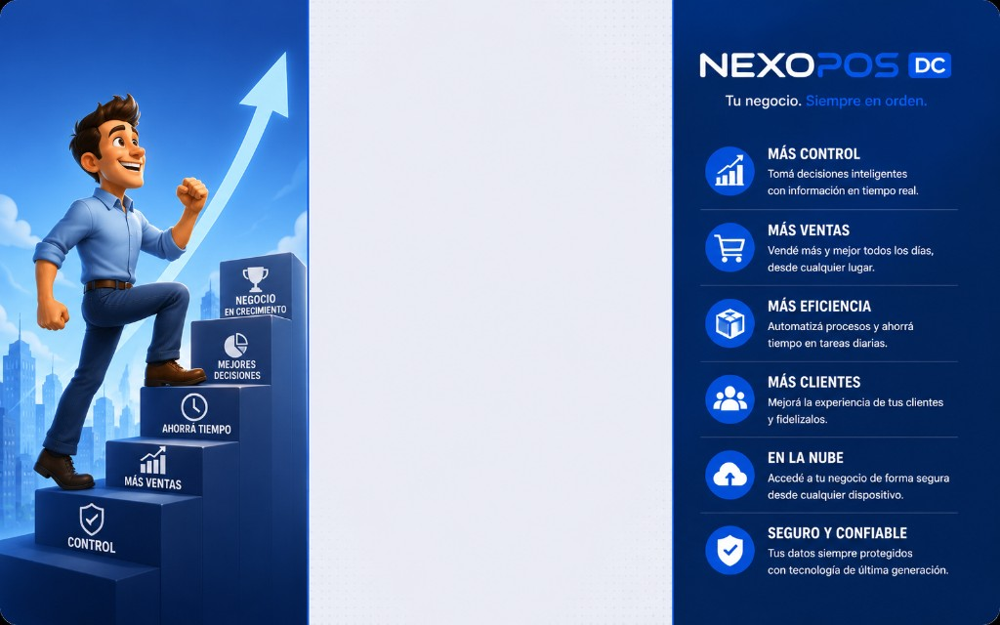
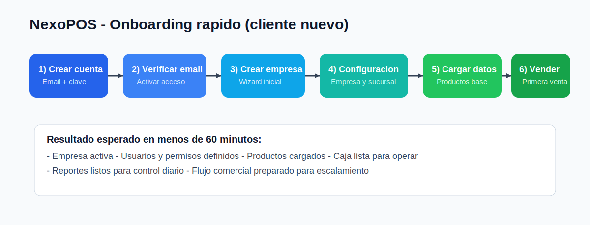
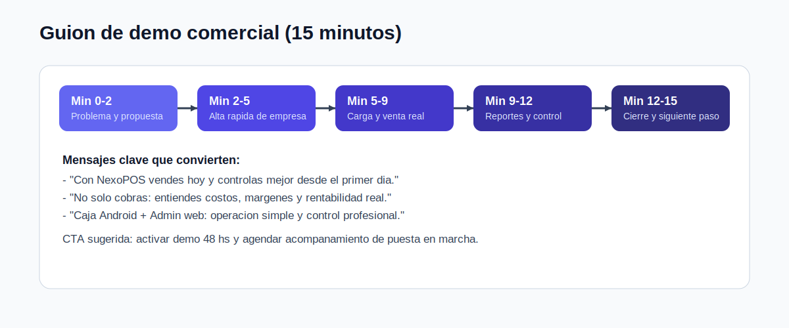

# Guia comercial para clientes NexoPOS

Version orientada a cliente final, preventa y onboarding comercial.

## Portada visual (marca)

## 1. Que es NexoPOS (explicado simple)

NexoPOS es un sistema para comercios que permite:

- vender rapido en mostrador;
- controlar stock y compras;
- registrar gastos y entender rentabilidad;
- administrar usuarios, sucursales y permisos;
- operar caja Android y panel administrador web en paralelo.

## 2. Como arrancar en 3 pasos

1. Crear cuenta desde login.
2. Verificar email y crear empresa.
3. Ingresar al sistema y comenzar a cargar productos.

Tambien podes probar primero con demo de 48 hs.

## 3. Flujo de alta recomendado (implementacion rapida)

Tiempo objetivo: entre 30 y 60 minutos para dejar el negocio operativo.

## 4. Crear empresa (alta normal)

### Paso a paso para cliente

1. Entrar a `https://nexopos-dc.web.app/login`.
2. Click en **Crear empresa**.
3. Completar email y clave.
4. Confirmar correo.
5. Crear empresa y completar datos iniciales.
6. Entrar al panel administrador.

### Recomendacion comercial

Acompanhar este paso en vivo durante la primera llamada para asegurar conversion y activacion.

## 5. Crear demo de 48 horas (alta comercial)

### Paso a paso para demo

1. Desde login, click en **Probar demo gratis (48 hs)**.
2. Registrar cuenta.
3. Verificar correo.
4. Confirmar creacion de empresa demo.
5. Recorrer modulos clave.

### Objetivo de la demo

- que el cliente vea valor operativo real;
- que pruebe una venta completa;
- que valide reportes y control de costos.

## 6. Ingreso correcto al sistema

En login hay dos modos:

- **Administrador**: abre el panel web completo.
- **Cajero**: abre mostrador/caja.

Si el usuario no tiene rol admin, el sistema evita el acceso administrativo y lo dirige al modo cajero.

## 7. Que funciones mostrar en una demo (orden sugerido)

1. Dashboard (vision general).
2. Productos (alta simple).
3. Ventas / Caja (operacion real).
4. Compras e Inventario.
5. Finanzas (gastos + impacto en costos).
6. Reportes (ventas, compras, ganancias).
7. Usuarios y permisos.
8. Configuracion de empresa/sucursales.

## 8. Guion comercial de 15 minutos (listo para usar)

## 9. Diferencial comercial que conviene remarcar

- Demo 48 hs lista para uso real.
- Caja Android para operacion de mostrador.
- Admin web para control completo.
- Gestion de gastos integrada al analisis de costos.
- Estructura multi-tenant pensada para escalar.
- Modelo de planes por modulos + usuarios.

## 10. Caja Android (mensaje simple para cliente)

### Descargar app

- URL fija: `https://nexopos-dc.web.app/app-caja.apk`

### Actualizar app

- Desde el boton **Actualizar** en caja.
- El sistema compara version instalada vs version publicada.
- Solo descarga si hay una nueva.

### Soporte remoto

- Desde login: boton **Soporte remoto (TeamViewer)**.

## 11. Preguntas frecuentes para ventas y soporte

### "No se por donde empezar"

Usar onboarding rapido: empresa -> productos -> primera venta -> reportes.

### "Puedo probar antes de contratar?"

Si, con demo de 48 horas.

### "Necesito usar tablet en mostrador y admin aparte"

Si: caja en APK Android y administracion en web.

### "Puedo limitar usuarios?"

Si, la plataforma contempla cupos por plan y control de sesiones.

## 12. Checklist de cierre comercial

- Cliente creo cuenta o demo.
- Verifico email.
- Creo empresa.
- Realizo primera venta.
- Vio al menos un reporte.
- Entendio plan recomendado.
- Quedo acordado siguiente paso (alta paga o capacitacion).

## 13. Material para completar con capturas reales (recomendado)

Para que este manual quede listo para envio final a clientes, conviene agregar capturas propias de:

1. Pantalla de login.
2. Flujo crear empresa.
3. Wizard inicial.
4. Pantalla de cajero en tablet horizontal.
5. Reporte de ventas.
6. Pantalla de gastos y precio sugerido.

Sugerencia: guardar esas imagenes en `docs/media/capturas/` y referenciarlas en esta guia.

---

Si queres, en el siguiente paso te dejo una **version PDF comercial** (misma estructura, mas limpia para compartir por WhatsApp o mail).
